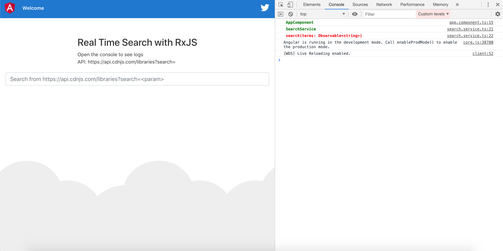
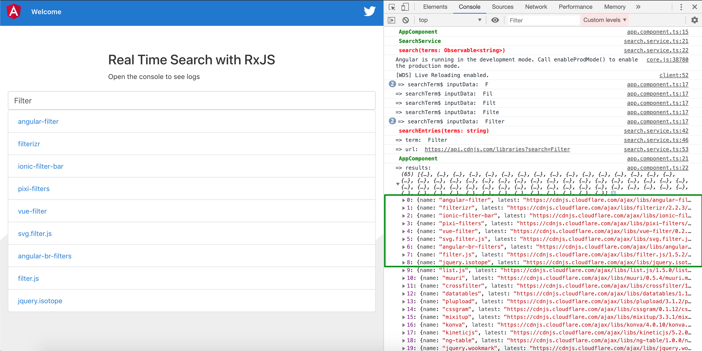

# Angular App Real Time Search with RxJS

-   This project was generated with [Angular CLI](https://github.com/angular/angular-cli) version 8.3.2.
-   DEMO: https://stevedang-dev.github.io/Angular-Real-Time-Search-With-RxJS/

-   Package.json

```
"build": "ng build --base-href=https://stevedang-dev.github.io/Angular-Real-Time-Search-With-RxJS/",
```




---

# Source Code:

## 1. View template:

```
    <div class="top-content">
        <h3>Real Time Search with RxJS</h3>
        <p>Open the console to see logs</p>
        <p>API: https://api.cdnjs.com/libraries?search=</p>
    </div>
    <!-- Pass search terms as we type -->
    <input
        class="form-control"
        (keyup)="searchTerm$.next($event.target.value)"
        placeholder="Search from https://api.cdnjs.com/libraries?search=<param>"
    />

    <ul class="list-group" *ngIf="results">
        <li class="list-group-item" *ngFor="let result of results | slice: 0:9">
            <a href="{{ result.latest }}" target="_blank">
                {{ result.name }}
            </a>
        </li>
    </ul>
```

---

## 2. Search Service:

-   Import and API

```
import { Observable, of } from 'rxjs';
import { HttpClient } from '@angular/common/http';
import { debounceTime, distinctUntilChanged, switchMap } from 'rxjs/operators';

...

baseUrl = 'https://api.cdnjs.com/libraries';
queryUrl = '?search=';

```

-   Search method:

```
search(terms: Observable<string>): any {
    console.log('%c SearchService', 'color: green; font-weight: bold');
    console.log(
        '%c search(terms: Observable<string>)',
        'color: red; font-weight: bold'
    );
    return terms.pipe(
        // debounceTime(400): waits until there’s no new data for the provided amount of time
        debounceTime(400),
        // distinctUntilChanged():
        //      will ensure that only distinct data passes through
        //      will only send the data once
        distinctUntilChanged(),
        // switchMap():
        //      combines multiple possible observables received from the searchEntries method into one,
        //      which ensures that we use the results from the latest request only.
        switchMap((term: string) => this.searchEntries(term))
    );
}
```

-   Search Entries:

```
// searchEntries(term): makes a get request to our API endpoint with our search term, this gives us another observable
searchEntries(term: string): Observable<object> {
    console.log(
        '%c searchEntries(terms: string)',
        'color: red; font-weight: bold'
    );
    console.log('=> term: ', term);
    if (term === '') {
        return of({});
    }
    // Create the request url with search term in the query params
    // Example: url = https://api.cdnjs.com/libraries?search=filter
    const url = `${this.baseUrl}${this.queryUrl}${term}`;
    console.log('=> url: ', url);
    return this.http.get(url);
}

```

---

## 3. Component:

```
console.log('%c AppComponent', 'color: green; font-weight: bold');
this.searchTerm$.subscribe(inputData => {
    console.log('=> searchTerm$ inputData: ', inputData);
});
this.searchService.search(this.searchTerm$).subscribe(results => {
    this.results = results.results;
    console.log('%c AppComponent', 'color: green; font-weight: bold');
    console.log('=> results: ', this.results);
});

```
